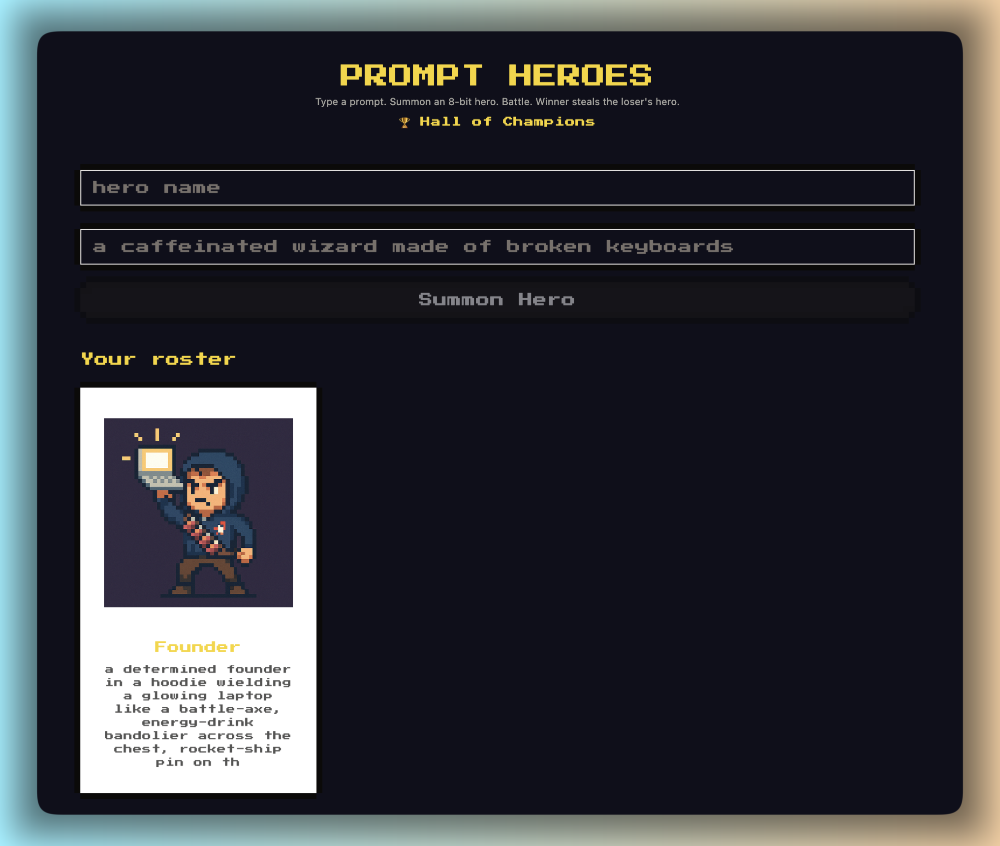

# Prompt Heroes

Type a prompt → AI draws an 8-bit hero → two heroes fight → an AI judge picks the
winner → **the winner captures the loser's hero** (ownership transfers to the
winner's roster; nobody is destroyed). Real-time online via Convex, accounts via Clerk.

<p align="center">
  
</p>

Built with Next.js 16, [8bitcn/ui](https://8bitcn.com), Convex (reactive DB +
realtime + the battle state machine), [Clerk](https://clerk.com) auth, and the
Vercel AI Gateway (image model + judge model). Animated-sprite technique adapted
from [petdex](https://github.com/crafter-station/petdex) (MIT).

## Features

- **Prompt → sprite.** Type a description; an AI image model draws an 8-bit hero.
- **AI judge.** A text model reads both heroes, picks a winner, and narrates the fight.
- **Capture mechanic.** The winner takes the loser's hero into their roster. No permadeath.
- **Real accounts.** Clerk-gated sign-in; heroes are owned by your verified user.
- **Hall of Champions.** Public `/champions` leaderboard ranking heroes by captures.
- **Animated sprites (optional).** A 4×4 CSS-`steps()` spritesheet behind `SPRITE_MODE=sheet`.

## Setup

```bash
npm install
cp .env.local.example .env.local      # fill in AI_GATEWAY_API_KEY + Clerk keys
npx convex dev                        # login + provision; writes NEXT_PUBLIC_CONVEX_URL
clerk auth login && clerk init        # provisions Clerk + writes the Clerk keys
npm run dev                           # in another terminal
```

### Required credentials

1. **`AI_GATEWAY_API_KEY`** — Vercel AI Gateway, used for both the image model
   and the judge (`SPRITE_IMAGE_MODEL` / `JUDGE_MODEL` override the defaults).
   The judge runs inside a Convex **action** with its own environment, so set the
   key on the deployment too: `npx convex env set AI_GATEWAY_API_KEY <key>`.
2. **Convex** — `npx convex dev` provisions the deployment and regenerates
   `src/convex/_generated/`.
3. **Clerk** — `clerk init` installs `@clerk/nextjs` and writes the publishable/secret
   keys. One manual step: in the Clerk dashboard create a **JWT template named
   `convex`** (the Convex preset) so Convex can verify Clerk tokens. The issuer in
   `src/convex/auth.config.ts` must match your Clerk instance's Frontend API URL.

## The de-risking spike (run this first)

```bash
npm run spike   # needs AI_GATEWAY_API_KEY
```

Generates a single sprite, runs the judge, and generates a 4×4 spritesheet into
`scripts/out/`. **Eyeball the sheet:** the 4×4 grid generates reliably (the original
9×8 was too large and produced random, unaligned poses). If your sheets look clean,
set `SPRITE_MODE=sheet` to ship animated heroes; otherwise the default static sprite
(with a cheap CSS bob) is used.

## Tests

```bash
npm test       # vitest: CAS-fires-once, capture safety, judge validator (8 tests)
npm run e2e    # playwright: two browsers, loser captured on both screens (needs live backend)
```

## Architecture notes

- **Auth.** Clerk gates every route except `/champions` and the auth pages
  (`src/proxy.ts`). Convex verifies the Clerk JWT server-side; every mutation
  derives identity from `ctx.auth.getUserIdentity()`, so ownership can't be spoofed
  from the client. The API route reads the Clerk `userId` via `auth()`.
- **Judge fires exactly once.** `claimResolve` is a compare-and-set that only flips
  `both_locked → resolving`; the second caller no-ops, so the judge action runs once.
- **No wrong capture.** The judge's `winnerId` is validated against the two fighters
  in `lib/ai.ts` AND re-validated in `finishBattle`. An invalid verdict marks the
  battle `failed`; no hero changes hands and both players can rematch.
- **Capture, not permadeath.** On a valid verdict the loser's hero stays alive and
  its `ownerSessionId` (the winner's Clerk user id) flips to the winner's roster,
  and the winner's `captures` count increments (drives the leaderboard).

## Deploy

Frontend on Vercel (Git integration), backend on Convex cloud.

- **Build command:** `npx convex deploy --cmd 'npm run build'` — deploys Convex prod
  and builds Next.js pointed at it (auto-injects `NEXT_PUBLIC_CONVEX_URL`, so don't
  set that var manually).
- **Vercel env vars:** `CONVEX_DEPLOY_KEY`, `AI_GATEWAY_API_KEY`, the Clerk
  publishable + secret keys, and the four `NEXT_PUBLIC_CLERK_SIGN_*` URLs.
- **Clerk production** needs a domain you own (for DNS). Without one, deploying with
  the Clerk **dev** keys works fine for a demo (lower limits, a dev-mode banner).
